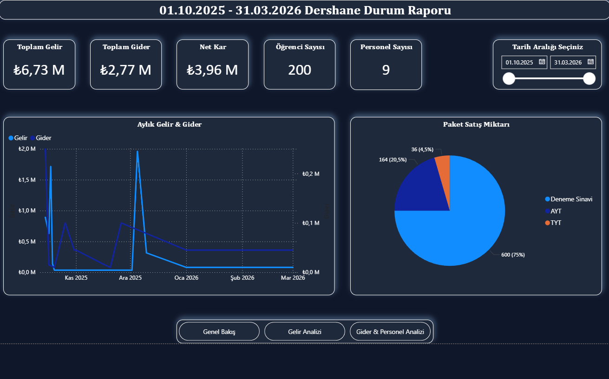
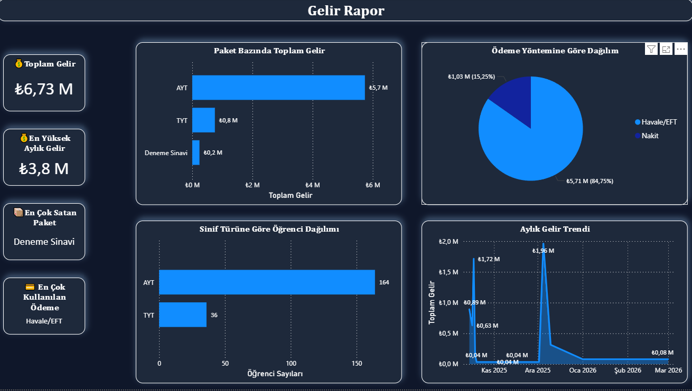
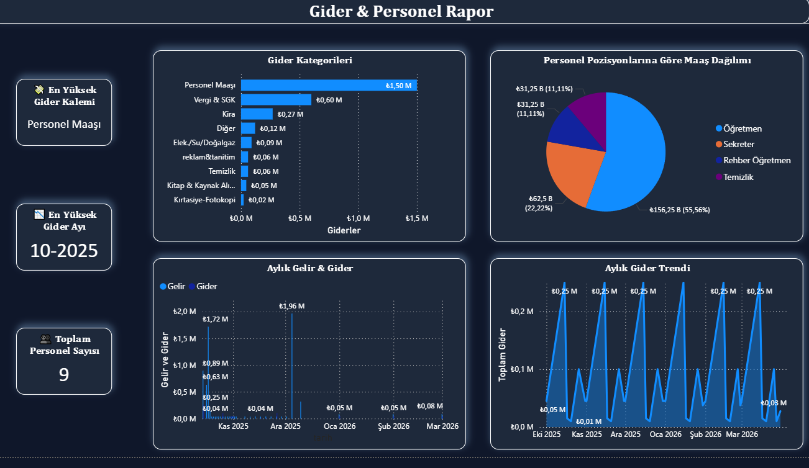

# 📊 Dershane Gelir-Gider Analizi

Python, Pandas ve SQL kullanılarak gerçekçi bir dershane senaryosu üzerinden yapılan 6 aylık finansal veri analizi projesi.

---

## 📊 Power BI Dashboard

### Genel Bakış


### Gelir Raporu


### Gider & Personel


## 📁 Proje Yapısı

```
dershane_analiz/
├── data/
│   ├── gelirler.csv
│   ├── giderler.csv
│   ├── ogrenciler.csv
│   ├── paketler.csv
│   ├── personel.csv
│   └── deneme_sinavlari.csv
├──sql_analiz.py
├──dershane.db
├──gorseller.py
├──PowerBI_Dosyasi/
│  ├── dershane_analiz.pbit
├──Gorseller/
│  ├── Gelir_Analizi.png
│  ├── gelir_gider.png
│  ├── Genel_durum_raporu.png
│  ├── gider_kategorileri.png
│  ├── net_kar.png
│  ├── odeme_yontemi.png
├── main.py        # Veri yükleme & temizleme
├── analiz.py      # Analiz soruları & hesaplamalar
└── README.md
```

---

## 🔍 Proje Hakkında

Bir dershanenin **Ekim 2025 – Mart 2026** tarihleri arasındaki gelir ve gider verilerinin analizi yapılmıştır.

**Veri seti:**
- 800+ gelir kaydı
- 6 farklı tablo
- 6 aylık finansal veri

---

## 📈 Temel Bulgular

| Metrik | Değer |
|--------|-------|
| Toplam Gelir | 6.732.040 TL |
| Toplam Gider | 2.767.500 TL |
| **Net Kar** | **3.964.540 TL** |

### Paket Bazında Gelir Dağılımı
| Paket | Gelir |
|-------|-------|
| AYT Paketi | 5.740.000 TL (%85) |
| TYT Paketi | 752.040 TL (%11) |
| Deneme Sınavı | 240.000 TL (%4) |

### Ödeme Yöntemi Dağılımı
| Yöntem | Tutar |
|--------|-------|
| Havale/EFT | 5.705.680 TL |
| Nakit | 1.026.360 TL |

### En Büyük Gider Kalemleri
| Kategori | Tutar |
|----------|-------|
| Personel Maaşı | 1.500.000 TL (%54) |
| Vergi & SGK | 600.000 TL (%22) |
| Kira | 270.000 TL (%10) |

---

## 🛠️ Kullanılan Teknolojiler

- **Python 3.12**
- **Pandas** — Veri temizleme & analiz
- **NumPy** — Sayısal hesaplama
- **Matplotlib — Görselleştirme
- **SQLite** — Veri sorgulama 
- **Power BI** — Dashboard 

---

## 🚀 Kurulum

```bash
pip install pandas numpy matplotlib seaborn
```

```python
python main.py   # Veriyi temizler
python analiz.py # Analizleri çalıştırır
```

---

## 📌 Yapılanlar

- [ ] Matplotlib ile gelir-gider grafikleri
- [ ] SQLite entegrasyonu
- [ ] Power BI dashboard

---

## 👤 Geliştirici

**Adem Karpuz** — [github.com/Ademnj](https://github.com/Ademnj) | [linkedin.com/in/ademkzj](https://linkedin.com/in/ademkzj)
